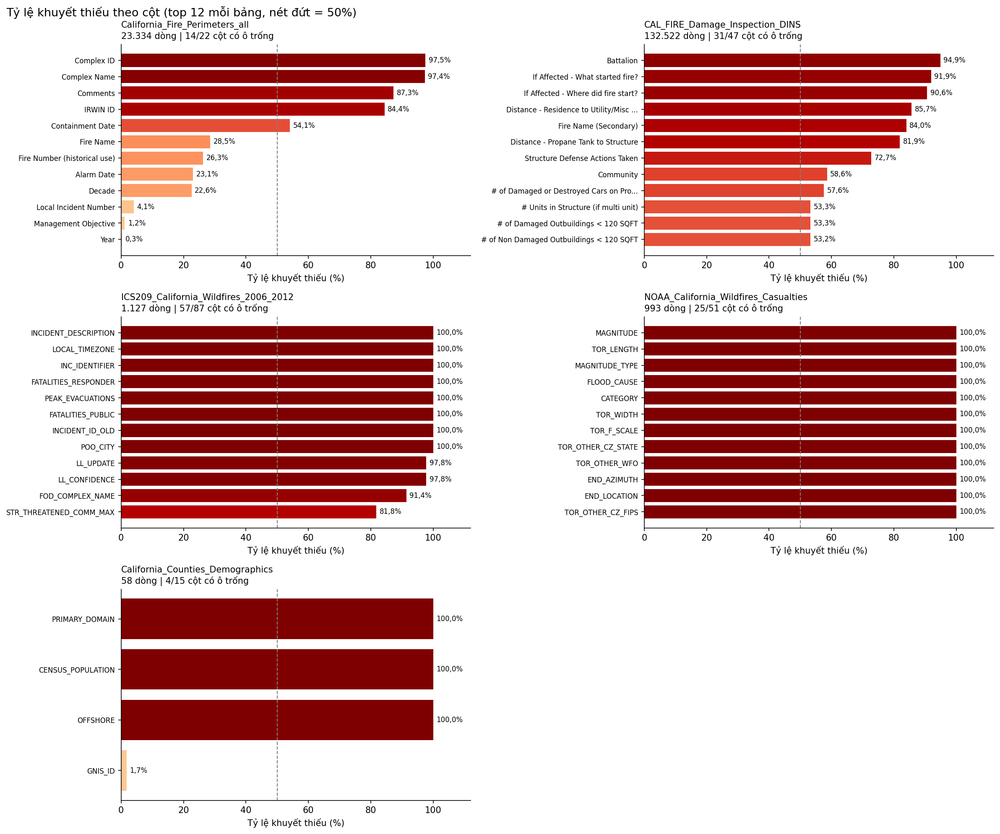
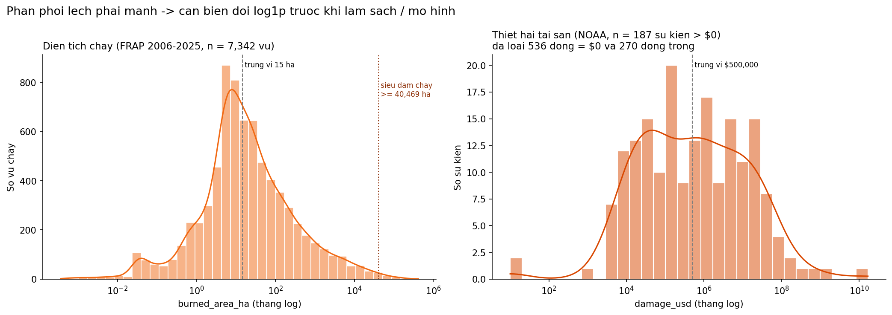
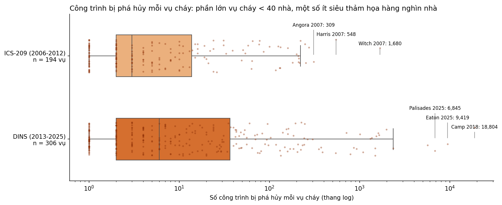
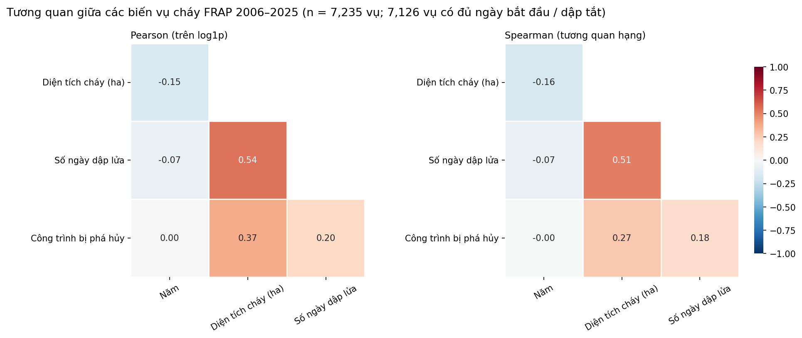
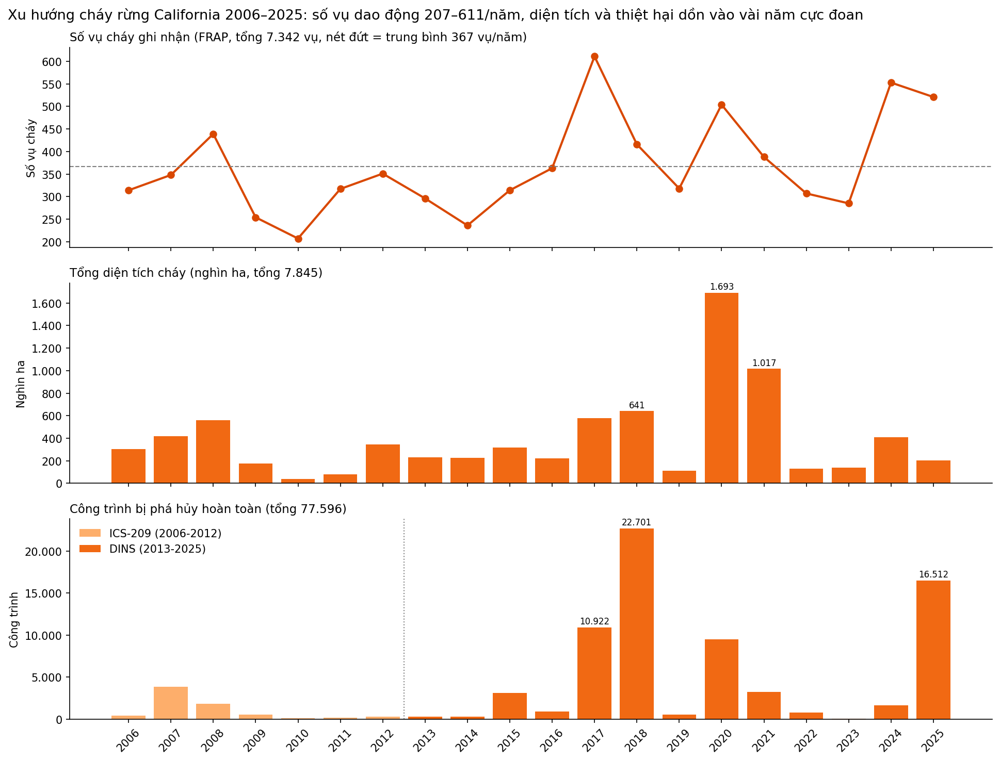
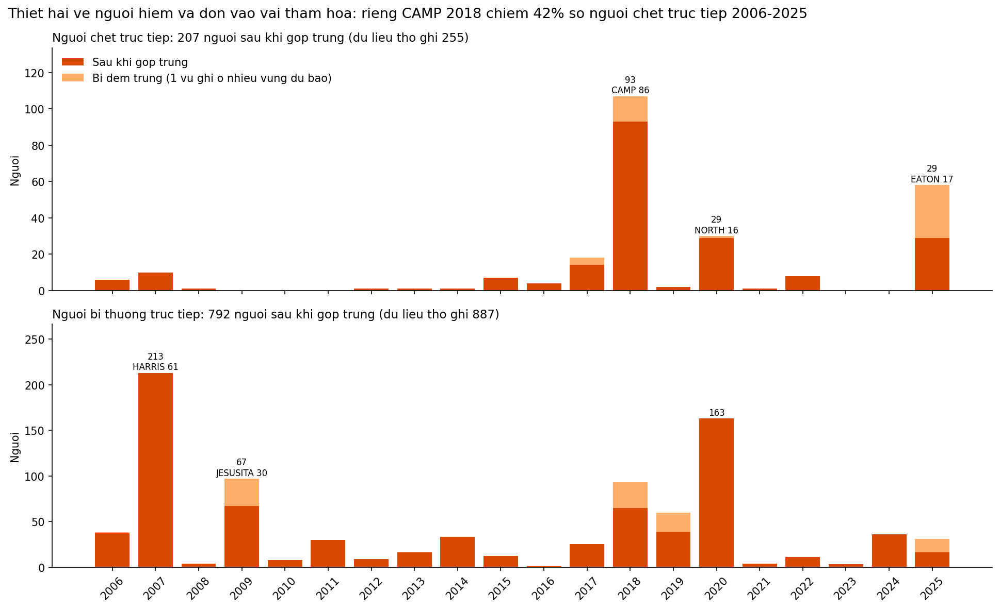

# Báo Cáo Chất Lượng Dữ Liệu Ban Đầu (DATA QUALITY REPORT)

> **Người phụ trách**: Thành viên 1 - Kỹ sư Dữ liệu (Data Engineer)  
> **Trạng thái**: Đã hoàn thành EDA dữ liệu thô (số liệu sinh từ `src/02_eda.py`, chạy lại bằng `python src/02_eda.py`)

---

## 1. Tổng Quan Tập Dữ Liệu Thô (Raw Data Overview)
*(Được trích xuất từ script `src/02_eda.py` — hàm `summarize_all_files()`)*

- **Tổng số dòng dữ liệu thô ban đầu**: **158.034 dòng** trên 5 file.
- **Tổng số cột**: **222 cột** (chưa hợp nhất).
- **Dung lượng file thô**: **66,5 MB** (DINS chiếm 60,5 MB).
- **Khoảng thời gian ghi nhận**: FRAP lưu từ 1878 nhưng chỉ giữ **2006–2025**; ICS-209 phủ 2006–2012, DINS phủ 08/2013–11/2025, NOAA phủ đủ 2006–2025 (20/20 năm).

| File | Nguồn | Số dòng | Số cột | Ô trống (%) | Phạm vi thời gian | Dòng dùng cho dự án |
|------|-------|---------|--------|-------------|-------------------|---------------------|
| `California_Fire_Perimeters_all.csv` | CAL FIRE FRAP | 23.334 | 22 | 24,0 | 1878–2025 (77 dòng thiếu năm) | 7.342 vụ (2006–2025) |
| `CAL_FIRE_Damage_Inspection_DINS.csv` | CAL FIRE DINS | 132.522 | 47 | 22,7 | 07/08/2013 – 23/11/2025 | 70.390 công trình bị phá hủy (>50%) |
| `ICS209_California_Wildfires_2006_2012.csv` | USDA / NIFC ICS-209-PLUS | 1.127 | 87 | 27,1 | 2006–2012 | 194 vụ có phá hủy ≥ 1 công trình (7.206 công trình) |
| `NOAA_California_Wildfires_Casualties.csv` | NOAA NCEI Storm Events | 993 | 51 | 42,7 | 2006–2025 | 993 sự kiện |
| `California_Counties_Demographics.csv` | CDTFA / Census | 58 | 15 | 20,1 | — | 58 Hạt |

---

## 2. Thống Kê Giá Trị Thiếu (Missing Values Analysis)

Số liệu tính trên phạm vi dự án (FRAP 2006–2025: 7.342 dòng; ICS-209: 1.127; DINS: 132.522; NOAA: 993).

| Tên Cột | Cột nguồn | Số Dòng Thiếu (Missing Count) | Tỷ Lệ Thiếu (%) | Mức Độ Nghiêm Trọng | Hướng Xử Lý Dự Kiến |
|---------|-----------|-------------------------------|-----------------|---------------------|----------------------|
| `acres_burned` / `burned_area_ha` | FRAP `GIS Calculated Acres` | 0 / 7.342 | 0,0 | Thấp | Không cần điền. Lưu ý 291 vụ < 0,1 ha (polygon rất nhỏ) — gắn cờ, không xóa |
| `structures_destroyed` | ICS-209 `STR_DESTROYED_TOTAL`; DINS `* Damage` | 0 / 1.127 (ICS); 0 / 132.522 (DINS) | 0,0 | Thấp | Hợp nhất ICS-209 (2006–2012) + DINS (2013–2025). Vụ FRAP không khớp → 0 (không có ghi nhận phá hủy) |
| `damage_property_usd` | NOAA `DAMAGE_PROPERTY` | 270 / 993 | 27,2 | **Cao** | Thêm 536 dòng = `$0` (54,0%) — cần quyết định `$0` là "không thiệt hại" hay "không ghi nhận". Chỉ 187 sự kiện có giá trị > 0 |
| `deaths_direct` / `injuries_direct` | NOAA `DEATHS_DIRECT`, `INJURIES_DIRECT` | 0 / 993 | 0,0 | Thấp | Đầy đủ nhưng **bị đếm trùng**: dữ liệu thô cộng ra 255 chết, 887 bị thương trực tiếp (+12 chết, +261 bị thương gián tiếp); sau khi gộp trùng vùng dự báo còn **207 / 792** (+10 / +261), xem mục 4 |
| `cause_name` / `cause_code` | FRAP `Cause` | 0 / 7.342 (trống) — nhưng **2.381 mã 14 "Unknown"** | 0,0 (thực tế **32,4%** không rõ) | **TB–Cao** | Coi mã 14 là thiếu → dự đoán bằng Random Forest (`cause_is_predicted`) |
| `latitude` / `longitude` | DINS `Latitude`/`Longitude`; ICS-209 `POO_LATITUDE`/`POO_LONGITUDE`; NOAA `BEGIN_LAT`/`BEGIN_LON` | DINS 0; ICS-209 9 / 1.127; **NOAA 993 / 993** | 0,0 / 0,8 / **100** | Thấp (DINS) – Cao (NOAA) | Tất cả tọa độ có giá trị đều nằm trong Bounding Box California. NOAA không có tọa độ → ghép theo Hạt/thời gian |
| `alarm_date` / `containment_date` | FRAP `Alarm Date`, `Containment Date` | 19 / 7.342; 104 / 7.342 | 0,3 / 1,4 | Thấp | Thời gian dập lửa < 0 hoặc > 365 ngày coi là lỗi nhập liệu → NULL (109 / 7.235 vụ không tính được) |
| `county_population` | Demographics `CENSUS_POPULATION` | **58 / 58** | **100** | **Cao** | Cột trống hoàn toàn — **không thể** lấy dân số Hạt từ file này như `DATA_DICTIONARY.md` mô tả. Cần nguồn khác (Census API / DOF E-1) |

**Các cột trống hoàn toàn nên loại bỏ khi làm sạch**: NOAA có 21 cột trống 100% (nhóm `TOR_*`, `FLOOD_CAUSE`, `MAGNITUDE`, `CATEGORY`, `END_LOCATION`…, vốn dành cho lốc xoáy / lũ); ICS-209 có 8 cột trống 100% (vd `INCIDENT_DESCRIPTION`, `FATALITIES_PUBLIC`, `PEAK_EVACUATIONS`); Demographics có 3 cột (`PRIMARY_DOMAIN`, `CENSUS_POPULATION`, `OFFSHORE`). Trong FRAP, `Complex ID` / `Complex Name` thiếu ~97% là bình thường (đa số vụ cháy không thuộc tổ hợp).

---

## 3. Phân Tích Dữ Liệu Trùng Lặp (Duplicate Analysis)
- **Số dòng trùng lặp hoàn toàn (Exact Duplicates)**: **0** ở cả 5 file. Bỏ qua cột mã (`OBJECTID`, `EVENT_ID`, `EPISODE_ID`…) thì NOAA có **1** dòng trùng.
- **Số dòng trùng lặp logic**:
  - DINS: **109** dòng trùng trên (tên vụ cháy, ngày bắt đầu, số nhà, tên đường, thành phố, loại công trình, tọa độ) — nghi kiểm kê lặp.
  - FRAP 2006–2025: **101** dòng trùng (năm, tên vụ cháy, `Unit ID`) — chủ yếu là 1 vụ cháy gồm nhiều polygon, **cần gộp chứ không xóa** (cộng diện tích).
  - Trùng tên khác vụ: 497 cặp (năm, tên) trong FRAP gắn với nhiều vụ khác nhau. Ví dụ **CAMP 2018** gồm Camp Fire tại Butte (`BTU`, 153.336 acres) và một vụ 13,5 acres tại San Luis Obispo (`SLU`) → bắt buộc dùng Khóa 3 (`Unit ID` / Hạt) để phân biệt.
- **Tỷ lệ trùng lặp**: 0 % trùng hoàn toàn; trùng logic ≈ **0,08 %** (DINS 109 / 132.522) và **1,4 %** (FRAP 101 / 7.342).

---

## 4. Phân Bố & Ngoại Lai Sơ Bộ (Distributions & Initial Outliers)

- **Diện tích cháy (Acres / Ha)**: Phân phối lũy thừa cực đoan (heavy-tailed). Trung vị chỉ **14,6 ha**, lớn nhất **417.919 ha**. 87,7% số vụ < 1.000 acres. **33 siêu đám cháy (≥ 100.000 acres)** chiếm **44,6%** tổng diện tích cháy 2006–2025. Độ lệch (skewness) giảm từ **26,26 → 0,99** sau `log1p` → bắt buộc biến đổi log trước khi làm sạch / mô hình.
  > ⚠️ Con số "siêu đám cháy chiếm hơn 70% tổng diện tích" trong `docs/DEMO_SCRIPT.md` **không khớp** với dữ liệu FRAP (44,6%) — cần sửa lại kịch bản demo.

- **Nhà cửa bị phá hủy (structures_destroyed)**: Tổng **77.596** công trình (ICS-209 7.206 + DINS 70.390) trên 500 vụ có phá hủy. 75% số vụ phá hủy < 40 công trình, nhưng **10% vụ lớn nhất chiếm 90,8%** tổng số, và riêng 3 vụ **Camp 2018 (18.804), Eaton 2025 (9.419), Palisades 2025 (6.845)** chiếm **45,2%**.
  - Ngưỡng Tukey 1,5×IQR trên thang gốc gắn cờ 83 vụ (quá nhiều do phân phối lệch); trên thang log chỉ còn **10 vụ** (DINS 4, ICS-209 6) — đúng các siêu thảm họa. → Isolation Forest nên chạy trên `log1p`. Đây là sự kiện thật: **gắn cờ, không xóa**.

- **Tương quan** (7.235 vụ FRAP sau khi gộp polygon): diện tích ↔ số ngày dập lửa tương quan khá (Pearson log 0,54 / Spearman 0,51); diện tích ↔ công trình bị phá hủy chỉ yếu (0,37 / 0,27); năm gần như không tương quan với các biến. → **Cháy lớn chưa chắc phá hủy nhiều nhà** (Eaton 2025 chỉ ~5.700 ha nhưng phá hủy 9.419 công trình) — thiệt hại phụ thuộc vào vị trí so với khu dân cư.

- **Xu hướng thời gian**: số vụ dao động 207–611 vụ/năm (trung bình 367), không có xu hướng tăng rõ; nhưng diện tích và thiệt hại dồn vào vài năm cực đoan: **2020** (1,69 triệu ha), **2018** (22.701 công trình), **2025** (16.512 công trình), **2017** (10.922 công trình).
- **Tọa độ địa lý**: Toàn bộ tọa độ DINS (132.522) và ICS-209 (1.118 có giá trị) **nằm trong** Bounding Box California (vĩ độ $32^{\circ}$–$42^{\circ}$N, kinh độ $-125^{\circ}$–$-114^{\circ}$W). NOAA không có tọa độ (100% trống).

- **Thiệt hại về người (NOAA)**: NOAA chỉ dùng cho thương vong; thiệt hại tài sản lấy từ DINS + ICS-209 (cột `DAMAGE_PROPERTY` trống 27,2%, `$0` 54,0%, ghi thiếu nặng năm 2025 nên không dùng).
  - **Đếm trùng**: 1 vụ cháy lan qua nhiều vùng dự báo NWS được ghi thành nhiều dòng, mỗi dòng lặp lại cùng số thương vong (vd Woolsey 2018: 5 dòng × 3 người; Eaton + Palisades 2025: 4 dòng, 58 → 29 người). Sau khi gộp theo (`EPISODE_ID`, tên vụ cháy): người chết trực tiếp **255 → 207**, bị thương **887 → 792**.
  - **Hiếm và tập trung**: 8/20 năm có 0–1 người chết; riêng **Camp 2018 (86 người) chiếm 42%**. Diện tích cháy không đi kèm số người chết (2020 cháy 1,69 triệu ha – 29 người; 2018 chỉ ~641 nghìn ha – 93 người), mà đi theo số công trình bị phá hủy.
  - **Ghi thiếu**: NOAA không có đợt cháy Wine Country 10/2017 ở Sonoma / Napa → số năm 2017 (14 người) thấp hơn thực tế; cần ghi chú khi trình bày.

---

## 5. Tóm Tắt Vấn Đề & Việc Cần Làm Ở Bước Làm Sạch

| # | Vấn đề | Ảnh hưởng | Xử lý trong |
|---|--------|-----------|-------------|
| 1 | Tên vụ cháy không đồng nhất giữa nguồn (`CMPLX`/`COMPLEX`, hậu tố `FIRE`/`INCIDENT`) | Ghép thô theo (năm, tên) chỉ khớp 92,5% công trình; sau chuẩn hóa Khóa 1 đạt **95,3%** (73.911 / 77.596) | `03_clean.py` – Khóa 1 |
| 2 | Vụ trùng tên cùng năm khác địa bàn (CAMP 2018 BTU/SLU) | Gán sai thiệt hại và thời gian dập lửa | `03_clean.py` – Khóa 3 |
| 3 | 1 vụ cháy = nhiều polygon FRAP | Đếm trùng số vụ | `03_clean.py` – gộp theo (năm, tên, Unit ID) |
| 4 | `Cause` = 14 (Unknown) chiếm 32,4% | Phân tích căn nguyên thiếu 1/3 dữ liệu | `03b_ml_clean.py` – Random Forest |
| 5 | `DAMAGE_PROPERTY` trống 27,2% + `$0` 54,0% | Thiệt hại USD thiếu nghiêm trọng | Không dùng – NOAA chỉ lấy thương vong; tài sản dùng DINS + ICS-209 |
| 6 | `CENSUS_POPULATION` trống 100% | Không tính được mật độ / thiệt hại theo đầu người | Bổ sung nguồn dân số khác |
| 7 | 109 dòng DINS trùng logic | Đếm dư công trình bị phá hủy | `03_clean.py` – khử trùng |
| 8 | 32 cột trống 100% (NOAA 21, ICS-209 8, Demographics 3) | Làm nặng dữ liệu, không có thông tin | `03_clean.py` – loại cột |
| 9 | NOAA ghi lặp thương vong khi 1 vụ cháy lan qua nhiều vùng dự báo | Người chết bị thổi lên 255 thay vì 207 | `03_clean.py` – bước 9b, gộp theo (`EPISODE_ID`, tên vụ cháy) |
