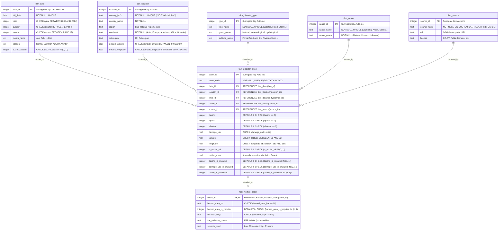

# Sơ Đồ Quan Hệ Thực Thể (ENTITY RELATIONSHIP DIAGRAM - ERD)

> **Người phụ trách**: Thành viên 2 - Kỹ sư Mô hình Dữ liệu (Data Modeling Engineer)  
> **Trạng thái**: Thiết kế Star Schema (Giai đoạn 1)

---

## 1. Thiết Kế Mô Hình Dạng Sao (Star Schema Architecture)
Mô hình dữ liệu được thiết kế nhằm phục vụ truy vấn phân tích đa chiều (OLAP) và trực quan hóa hiệu năng cao cho 12 biểu đồ tương tác:
- **Bảng Fact Trung Tâm**: `fact_disaster_event` (lưu vết toàn bộ sự kiện thảm họa thiên nhiên 2005–2024).
- **Bảng Fact Mở Rộng**: `fact_wildfire_detail` (chi tiết hóa các chỉ số kỹ thuật chuyên biệt cho cháy rừng: diện tích, công suất bức xạ FRP, thời gian kéo dài).
- **Các Bảng Dimension**: `dim_date`, `dim_location`, `dim_disaster_type`, `dim_cause`, `dim_source`.
- **Cột cờ kiểm soát chất lượng**: Các cờ ML (`is_outlier_ml`, `deaths_is_imputed`, `damage_usd_is_imputed`, `cause_is_predicted`) được bảo toàn trực tiếp trong bảng fact để hỗ trợ tính năng lọc dữ liệu gốc/ước lượng trên Dashboard.

---

## 2. Sơ Đồ Mermaid ERD

---

## 3. Quy Tắc Toàn Vẹn Tham Chiếu & Ràng Buộc
1. **Khóa ngoại (Foreign Keys)**: Bật `PRAGMA foreign_keys = ON;`. Mọi quan hệ đều cấu hình `ON DELETE RESTRICT ON UPDATE CASCADE`.
2. **Cam kết không có khóa mồ côi (Zero Orphaned FKs)**: Bảng fact chỉ được tham chiếu đến các ID đã tồn tại trong các bảng dimension.
3. **Ràng buộc kiểm tra (CHECK constraints)**: Đảm bảo miền giá trị vật lý và logic nghiệp vụ được bảo vệ ở tầng cơ sở dữ liệu.
4. **Chỉ mục tăng tốc (Indexes)**: Đánh index trên toàn bộ các cột FK và các trường thường xuyên `GROUP BY` / `WHERE` (ví dụ: `year`, `country_iso3`, `type_name`, `cause_group`).
