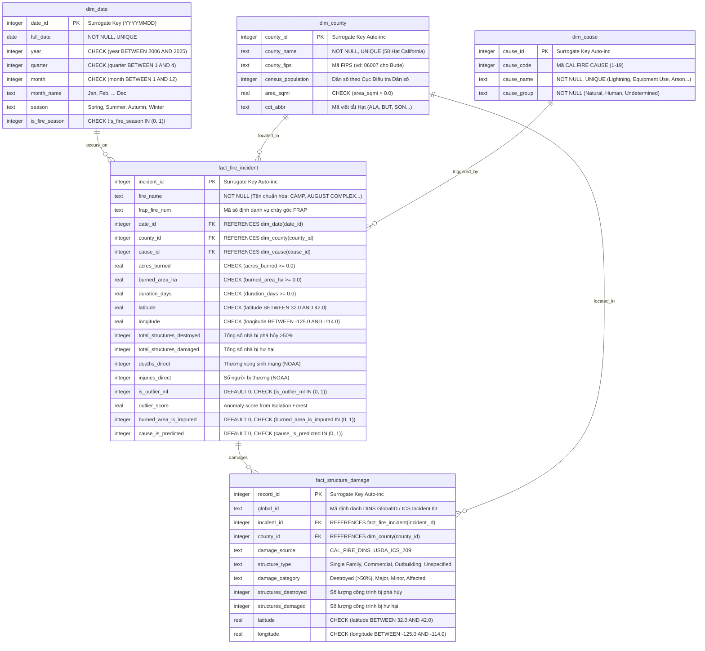

# Sơ Đồ Quan Hệ Thực Thể (ENTITY RELATIONSHIP DIAGRAM - ERD)

> **Người phụ trách**: Thành viên 2 - Kỹ sư Mô hình Dữ liệu (Data Modeling Engineer)  
> **Phạm vi dữ liệu**: Cháy rừng Bang California / Bắc Mỹ giai đoạn 2006–2025  
> **Trạng thái**: Thiết kế Star Schema đạt chuẩn tối thiểu 3NF, liên kết $\ge 3$ bảng

---

## 1. Thiết Kế Mô Hình Dạng Sao (Star Schema Architecture)
Mô hình dữ liệu được thiết kế nhằm phục vụ truy vấn phân tích đa chiều (OLAP) và trực quan hóa hiệu năng cao cho 10 biểu đồ tương tác, liên kết chặt chẽ giữa các vụ cháy rừng và các công trình bị tàn phá:
- **Bảng Fact Trung Tâm 1**: `fact_fire_incident` (lưu vết **7.342 vụ cháy rừng lịch sử California 2006–2025** từ CAL FIRE FRAP: diện tích Acres/ha, thời gian kéo dài, tọa độ, nguyên nhân, số nhà bị phá hủy liên tục 20 năm, thương vong NOAA).
- **Bảng Fact Mở Rộng 2**: `fact_structure_damage` (lưu vết chi tiết hơn 133.000 bản ghi kiểm kê công trình nhà ở, thương mại bị thiêu hại được **hợp nhất liên tục 20 năm: Giai đoạn 2006–2012 từ USDA Forest Service ICS-209 và Giai đoạn 2013–2025 từ CAL FIRE DINS**, liên kết $N - 1$ với `fact_fire_incident` qua `incident_id`).
- **Bảng Fact Thương Vong 3** (chỉ CSV, chưa nạp vào SQLite): `fact_casualty_event` (897 vụ cháy theo NOAA, đã gộp trùng vùng dự báo: 207 người chết, 792 người bị thương trực tiếp 2006–2025), liên kết `dim_date` qua `date_id` và `fact_fire_incident` qua `incident_id` (NULL nếu không khớp). Tổng hợp theo năm ở `data/clean/casualties_by_year.csv`.
- **Các Bảng Dimension**: `dim_county` (58 Hạt California kèm dân số, diện tích), `dim_cause` (bảng mã nguyên nhân CAL FIRE), `dim_date` (thứ bậc thời gian: ngày, tháng, quý, năm, mùa cao điểm cháy rừng).
- **Cột cờ kiểm soát chất lượng**: Các cờ ML (`is_outlier_ml`, `burned_area_is_imputed`, `cause_is_predicted`) được bảo toàn trực tiếp trong bảng fact để hỗ trợ tính năng lọc dữ liệu gốc/ước lượng trên Dashboard.

---

## 2. Sơ Đồ Mermaid ERD

---

## 3. Quy Tắc Toàn Vẹn Tham Chiếu & Ràng Buộc
1. **Khóa ngoại (Foreign Keys)**: Bật `PRAGMA foreign_keys = ON;`. Mọi quan hệ đều cấu hình `ON DELETE RESTRICT ON UPDATE CASCADE`.
2. **Cam kết không có khóa mồ côi (Zero Orphaned FKs)**: Bảng fact chỉ được tham chiếu đến các ID đã tồn tại trong các bảng dimension.
3. **Ràng buộc kiểm tra (CHECK constraints)**: Đảm bảo miền giá trị địa lý California (`latitude BETWEEN 32.0 AND 42.0`, `longitude BETWEEN -125.0 AND -114.0`) và logic nghiệp vụ được bảo vệ ở tầng cơ sở dữ liệu.
4. **Chỉ mục tăng tốc (Indexes)**: Đánh index trên toàn bộ các cột FK và các trường thường xuyên `GROUP BY` / `WHERE` (ví dụ: `year`, `county_id`, `cause_id`, `fire_name`).
